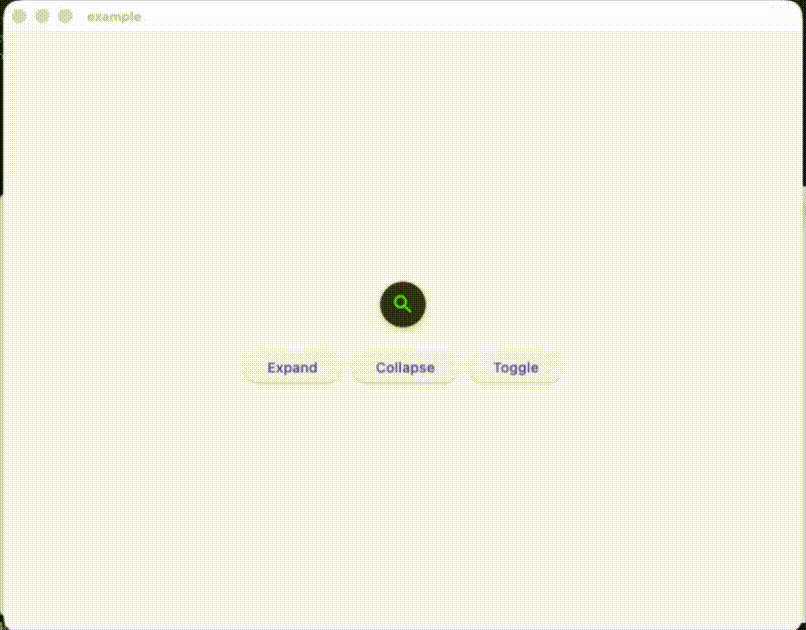

# Expandable Search Bar Plus

A **Flutter widget** that provides a beautiful and smooth expandable search bar animation. This package is an improved version of the original [`expandable_search_bar`](https://pub.dev/packages/expandable_search_bar) package, with enhanced flexibility and new features such as programmatic control via a controller.

> This widget is **based on** and inspired by the original `expandable_search_bar` package. The core logic and design pattern were adapted and extended to include more customization and better developer experience.

---

## 📱 Mobile Preview


## 🖥️ Desktop Preview



---

## Features

* Smooth expand/collapse animation.
* Fully customizable appearance (colors, radius, width, shadow, icon, etc.).
* Programmatic control using a custom controller.
* Mouse hover support (for web/desktop).
* Optional callbacks for tap and text changes.

---

## Example Usage

```dart
ExpandableSearchBarPlus(
  controller: TextEditingController(),
  hintText: 'Search something...',
  onTap: (isExpanded) {
    print('Search bar expanded: $isExpanded');
  },
  onChanged: (value) {
    print('Search text: $value');
  },
)
```

---

## Constructor Parameters

| Parameter                      | Type                                 | Default                                        | Description                                                   |
| ------------------------------ | ------------------------------------ | ---------------------------------------------- | ------------------------------------------------------------- |
| **key**                        | `Key?`                               | –                                              | Widget key.                                                   |
| **hintText**                   | `String?`                            | –                                              | Hint text inside the `TextField`.                             |
| **controller**                 | `TextEditingController`              | –                                              | Controller for the text field.                                |
| **barController**              | `ExpandableSearchBarPlusController?` | –                                              | Controller to programmatically control expand/collapse state. |
| **onTap**                      | `void Function(bool isExpanded)?`    | –                                              | Called when the icon is tapped. Returns `true` when expanded. |
| **onChanged**                  | `ValueChanged<String>?`              | –                                              | Called whenever the user types in the field.                  |
| **width**                      | `double`                             | `240`                                          | Width of the expanded search bar.                             |
| **iconSize**                   | `double`                             | `45`                                           | Diameter of the search icon container.                        |
| **gutter**                     | `double`                             | `16`                                           | Space between the icon and text field.                        |
| **radius**                     | `double`                             | `30`                                           | Corner radius of the search bar.                              |
| **animationDuration**          | `Duration`                           | `400ms`                                        | Duration of the main expand/collapse animation.               |
| **animationCurve**             | `Curve`                              | `Curves.fastOutSlowIn`                         | Curve for the expand/collapse animation.                      |
| **textFieldAnimationDuration** | `Duration`                           | `200ms`                                        | Duration of the text field width animation.                   |
| **textFieldAnimationCurve**    | `Curve`                              | `Curves.easeInOut`                             | Curve for text field width animation.                         |
| **iconBoxShadow**              | `List<BoxShadow>?`                   | –                                              | Custom shadow for the search icon.                            |
| **iconColor**                  | `Color`                              | `Color(0xff47E10C)`                            | Color of the search icon.                                     |
| **iconBackgroundColor**        | `Color`                              | `Color(0xff353535)`                            | Background color of the search icon.                          |
| **boxShadow**                  | `List<BoxShadow>?`                   | `[BoxShadow(...)]`                             | Box shadow of the expanded search bar.                        |
| **backgroundColor**            | `Color`                              | `Color(0xff101010)`                            | Background color of the search bar.                           |
| **textStyle**                  | `TextStyle`                          | `TextStyle(color: Colors.white, fontSize: 16)` | Style for the input text.                                     |
| **hintStyle**                  | `TextStyle`                          | `TextStyle(color: Colors.grey, fontSize: 16)`  | Style for the hint text.                                      |
| **supportMouse**               | `bool`                               | `false`                                        | Whether to support hover expand/collapse (for web/desktop).   |
| **icon**                       | `Widget`                             | `Icon(Icons.search_rounded)`                   | Custom icon widget displayed in the circular button.          |

---

## Programmatic Control

You can control the expand/collapse state programmatically using the `ExpandableSearchBarPlusController`.

```dart
final barController = ExpandableSearchBarPlusController();

ExpandableSearchBarPlus(
  controller: TextEditingController(),
  barController: barController,
);

// Expand programmatically
barController.expand();

// Collapse programmatically
barController.collapse();
```

---

## Credits

This package is an **improved version** of [`expandable_search_bar`](https://pub.dev/packages/expandable_search_bar). The base animation and concept were adapted and refactored to provide more flexibility and control for developers.
